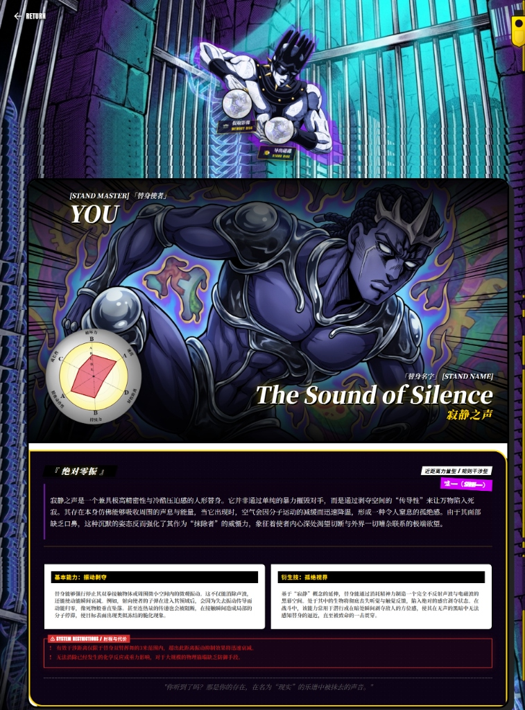

# JOJO 替身生成器 (JOJO Stand Generator)

> 你的替身，正如你的灵魂。

这是一个基于 AI 的 Web 应用。用户输入名字、音乐、颜色、性格和参考图后，应用会生成一份 JOJO 风格的替身档案，并尝试绘制对应形象。



## 功能

- 替身觉醒：根据用户输入生成替身名称、能力、面板和外观描述。
- JOJO 风格绘图：文本生成和图片生成分离，方便分别切换模型和接口。
- 雷达图展示：展示破坏力、速度、射程距离、持续力、精密动作性、成长性。
- 本地历史记录：通过 IndexedDB 保存历史生成结果。
- 双语命名：支持英文替身名和中文译名的组合展示。

## 技术栈

- 前端：React 19 + Vite
- 样式：Vanilla CSS
- 本地存储：IndexedDB
- 部署：Vercel Edge Functions

## 默认接口

- 文本 `GEMINI_BASE_URL` 默认值：`https://api.bltcy.ai/`
- 图片 `IMAGE_BASE_URL` 默认值：`https://api.bltcy.ai/`

如果你在环境变量里显式配置了 `GEMINI_BASE_URL` 或 `IMAGE_BASE_URL`，环境变量优先。

## 本地开发

1. 克隆仓库

```bash
git clone https://github.com/Kirie233/jojo-stand-generator.git
cd jojo-stand-generator
```

2. 安装依赖

```bash
npm install
```

3. 创建本地环境变量

把 `.env.example` 复制成 `.env`：

```bash
cp .env.example .env
```

推荐的本地开发配置：

```env
# 文本生成
VITE_GEMINI_API_KEY=your_text_key
# 默认值: https://api.bltcy.ai/
VITE_GEMINI_BASE_URL=https://api.bltcy.ai/
VITE_GEMINI_MODEL=gemini-3-flash-preview

# 图片生成
# 不配置时会复用上面的文本 Key
# 默认值: https://api.bltcy.ai/
VITE_IMAGE_API_KEY=your_image_key
VITE_IMAGE_BASE_URL=https://api.bltcy.ai/
VITE_IMAGE_MODEL=gpt-image-2
```

说明：

- `.env` 已被 `.gitignore` 忽略。
- `VITE_*` 变量会暴露到前端代码中，只适合本地开发调试。

4. 启动开发服务器

```bash
npm run dev
```

默认访问：`http://localhost:5173`

## Vercel 部署

### 架构说明

- 生产环境：浏览器请求前端，再由 Vercel 的 `/api/*` 代理到模型接口。
- 本地开发：前端可以直接使用 `.env` 里的 `VITE_*` 变量访问接口。

```text
[生产环境] 浏览器 -> Vercel Serverless (/api/generate, /api/gemini) -> AI API
[本地开发] 浏览器 -> 直连 AI API
```

### 需要配置的环境变量

在 Vercel 的 `Settings -> Environment Variables` 中配置：

| Key | 示例值 | 说明 |
| :--- | :--- | :--- |
| `GEMINI_API_KEY` | `sk-xxx...` | 必填，文本生成 Key |
| `GEMINI_BASE_URL` | `https://api.bltcy.ai/` | 选填，文本接口地址 |
| `GEMINI_MODEL` | `gemini-3-flash-preview` | 选填，文本模型 |
| `IMAGE_API_KEY` | `sk-xxx...` | 选填，图片生成 Key，不填则复用 `GEMINI_API_KEY` |
| `IMAGE_BASE_URL` | `https://api.bltcy.ai/` | 选填，图片接口地址 |
| `IMAGE_MODEL` | `gpt-image-2` | 选填，图片模型 |
| `IMAGE_QUALITY` | `high` | 选填，部分图片模型可用 |
| `IMAGE_SIZE` | `1024x1024` | 选填，部分图片模型可用 |

注意：

- 不要在 Vercel 生产环境里配置 `VITE_*` 变量。
- Vercel 上应只配置服务端变量，也就是上表这一组。
- 前端设置弹窗里的模型配置适合本地或单浏览器覆盖，不应该替代服务端默认配置。
- 当前默认生图模型是 `gpt-image-2`，但仍然保留 `gemini` 生图支持。

### 部署步骤

1. Fork 或上传仓库到 GitHub
2. 在 Vercel 导入该仓库
3. 配置上面的环境变量
4. 点击 `Deploy`

后续只要推送新代码，Vercel 会自动重新部署。

## 配置建议

如果你准备长期部署到 Vercel，建议采用下面这套规则：

- 服务端环境变量负责生产默认值
- `.env.example` 只作为本地开发模板
- `VITE_*` 只给本地调试使用
- 前端模型设置只做“本地覆盖”，不要作为项目默认配置来源

## 免责声明

本项目为 JOJO 粉丝向非商业项目。通过 AI 生成的内容仅供娱乐和学习使用。相关作品版权归原作者及版权方所有。

---

**To Be Continued...**
